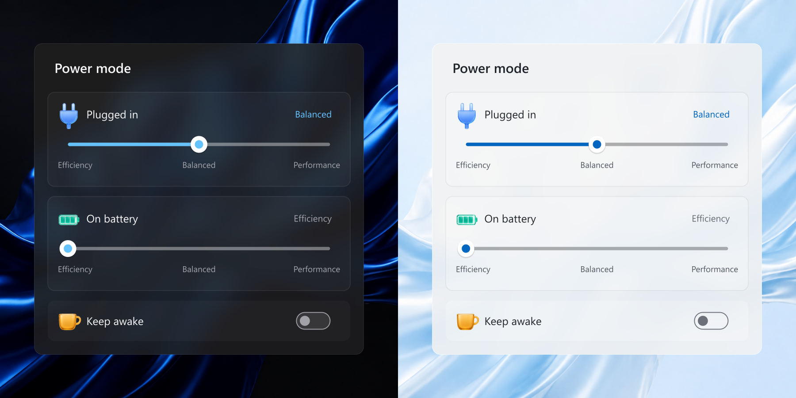

# Windows 11 Power Slider

[官方网站](https://kiteretsu903.github.io/windows-11-power-slider/) · [下载最新版](https://github.com/kiteretsu903/windows-11-power-slider/releases/latest)

[English](README.md) · 简体中文

轻量的**原生 C++ / Win32** 电源模式托盘工具，提供现代 Acrylic 界面与低常驻内存占用。



灵感来自 [PowerModeSlider](https://github.com/giulioungaretti/PowerModeSlider)，以独立原生实现带来插电/电池独立控制和普通安装器。

## 功能

- **原生轻量。** 无 .NET、WinUI 3、Qt 或 WebView 运行时依赖，关闭面板即释放图形资源。
- **现代外观。** Acrylic 背景模糊、自动浅色/深色主题、平滑弹出动画，以及适配 DPI、反映当前档位的托盘图标。
- **独立电源控制。** 插电与电池分别设置最佳能效、平衡、最佳性能三档。
- **保持唤醒与电池保护。** 保持系统和屏幕唤醒；电量过低或系统睡眠时自动关闭，不会自动重新开启。
- **简洁安装与设置。** 便携 EXE 或当前用户安装器，自动识别中英文，可选开机启动，无需导入证书。

## 使用

直接运行 `PowerModeNative.exe`，或使用安装程序。

- 点击托盘图标打开或关闭面板，点击面板外也会收起。
- 右键设置语言、开机启动或退出。
- 首次运行默认开启开机启动，可在托盘菜单关闭。

## 注意事项

适用于 Windows 11 x64，电源模式控制取决于设备上可用的 API。当前构建未签名。Acrylic 使用非公开 Windows 接口，不可用时回退为实色。


电池保护仅释放本程序的唤醒请求，最终睡眠、休眠或关机仍由 Windows 决定，无法防止突然断电造成的数据丢失。

## 构建

需要 Visual Studio C++ Build Tools、Windows SDK 和 CMake；生成安装器另需 Inno Setup 6。

```powershell
.\build.ps1 -Configuration Release -Installer
```

也可使用 LLVM-MinGW 构建便携 EXE：

```powershell
.\build-portable.ps1 -Toolchain 'D:\Tools\llvm-mingw'
```

[MIT 许可证](LICENSE) · [安全说明](SECURITY.md) · [图标来源](assets/fluent/SOURCE.md)
